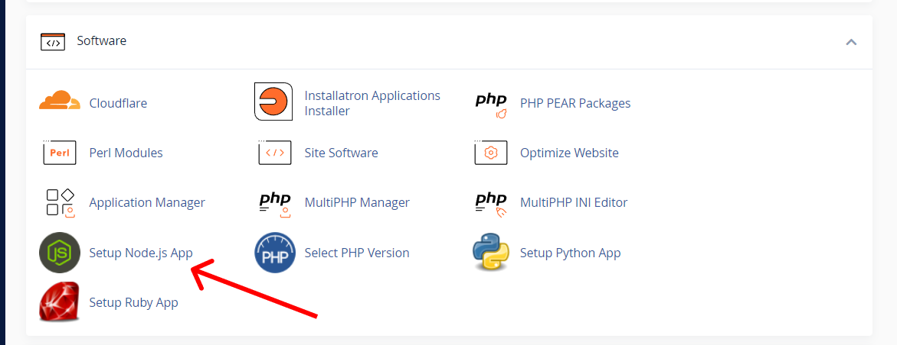
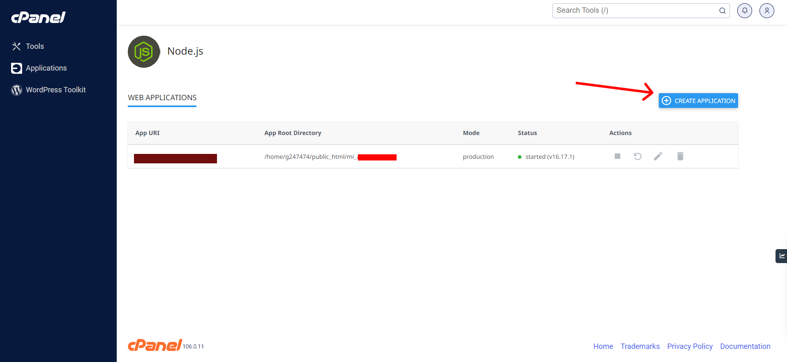
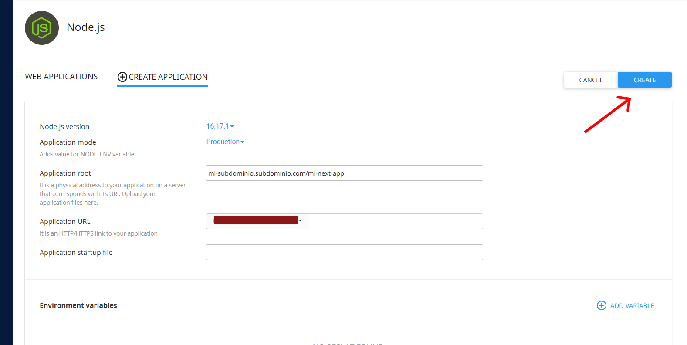
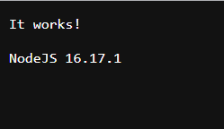
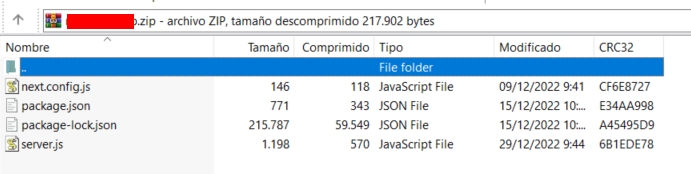
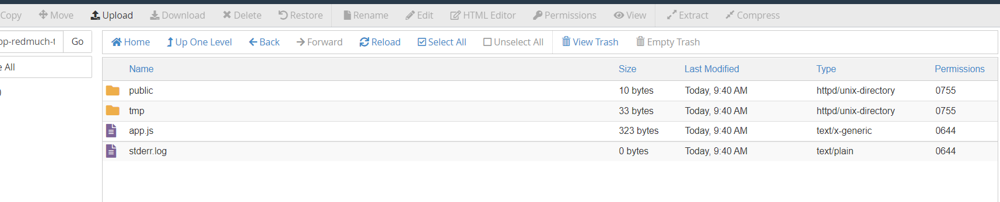
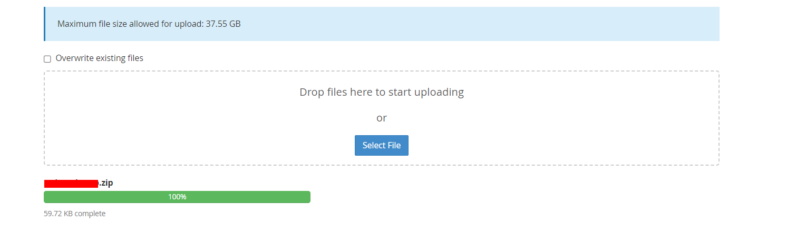
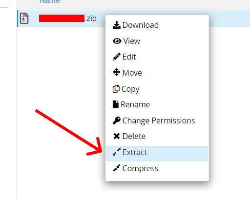
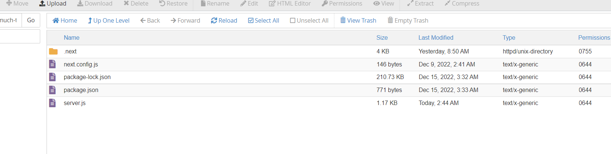
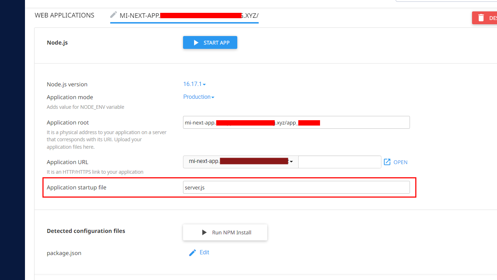

# ¿Cómo subir un proyecto de Next.js a cPanel con SSR?

cPanel es un panel de control que nos ayuda a administrar nuestros servidores de manera gráfica, normalmente ofrecido por muchas compañías de hosting con precios asequibles. Es por ello que resulta interesante conocer como desplegar diferentes tipos de aplicaciones dentro de esta plataforma.

Para lograr esto, se necesita que su cPanel contenga el servicio de crear aplicaciones en **Node.js**, puesto que será ahí donde montaremos la aplicación de Next.js.

Antes de empezar, especificar que tipo de versiones estaré utilizando:

- Node.js versión 16.17.1 (cPanel)
- Next.js versión 12.3.1
- react: 18.2.0
- react-dom: 18.2.0

También recalcar que lo estaré desplegando en un subdominio. El proceso será el mismo a como si lo desplegase en su dominio principal.

## Preparar su aplicación de Next.js

Antes de iniciar, vamos a configurar el proyecto, para ello vamos a crear una configuración muy parecida al `Custom Server` de Next.js [Custom Server](https://nextjs.org/docs/advanced-features/custom-server). No siga completamente los pasos que ahí le indique, puesto que le deshabilitará el SSR, solo vamos a tomar una pequeña parte.

Como nos indica la documentación, vamos a crear un archivo `server.js` en la raíz del proyecto de next, el cual servirá como nuestro archivo de entrada de cPanel. Copie y pegue el código que aparece en la documentación en su archivo `server.js` que acaba de crear.

## Cree su aplicación de Next.js a producción

Ejecute el comando `npm run build`. Éste le creará el directorio `.next`, antes de subirlo manualmente al gestor de archivos de cPanel, comprimalo dentro de un `.zip`.

**Nota** realizamos de manera local el `npm run build` y no en el cPanel puesto que este se cuelga en la nube (por experiencia propia y de otros usuarios, muy seguramente habrá alguna forma de evitar este problema y tener incluso una automatización, pero desconozco la forma).

## ¿Cómo crear una aplicación de Node.js en cPanel?

Como he mencionado, la aplicación de Next.js estará montada en el servicio de Node.js que ofrezca nuestro cPanel. Asegurese que el suyo propio lo tenga, si éste no lo tiene, probablemente deberá aumentar a un mejor plan donde le ofrezca este servicio.

Habrá otras ocasiones en donde sí le aparecerá aunque tenga un plan básico. Tenga especial cuidado con éste último puesto que, posiblemente tenga limitaciones muy grandes, por lo que al montar la app de Next.js, éste sature su servidor y quede inhabilitado. Si esto pasa, mi mejor recomendación será que se ponga en contacto con su proveedor.

Una vez que entre, cree una nueva aplicación, presionando el botón que se encuentra arriba a la derecha:

Veremos los siguientes parámetros en la configuración:

- **Node.js version**: Pondremos la versión de **16.17.1**.
- **Applicacion mode**: Colocamos **Production**
- **Applicacion root**: Coloque la ruta donde hospedará su aplicación de Next.js. Un ejemplo podría ser `public_html/mi_next_app`. En caso de que utilice un subdominio que se encuentra al mismo nivel de `public_html`, un ejemplo sería `subdominio.dominio/mi_next_app`
- **Applicación URL**: Selecciona la URL donde se servirá su aplicación, por ejemplo `mi-dominio.com`. En mi caso, colocaré mi subdominio.
- **Applicacion startup file**: Por el momento, dejarlo vacío. Lo llenaremos más adelante.

Ahora, presione el botón "CREATE" y si no hay ningún problema, su aplicación de Node.js ya estará lista para usarse.

De clíck en `OPEN` y esto lo redigirá automáticamente al dominio o subdominio que le haya asignado con el Node.js en funcionamiento:

**Nota** En la parte inferior podrá crear variables de entorno. No olvide que al momento de crear una variable de entorno, debe guardar los cambios presionando el botón "SAVE" (no lo digo porque me haya pasado y que haya estado 3 horas buscando el porqué... 😿).

Una vez que ya esté listo, detenga la aplicación de Node.js, presionando en el botón `STOP APP`. Esto lógicamente deshabilitará su aplicación pero será para subir nuestro proyecto de Next.js.

## Subir mi aplicación de Next.js a cPanel

Ahora que ya tiene su [servicio de Node.js](#cómo-crear-una-aplicación-de-nodejs-en-cpanel) y tiene la [build dentro de .zip](#preparar-su-aplicación-de-nextjs), vamos a subir primeramente los los archivos de configuración, el `server.js` y el `package.json`. Puede comprimirlo todo dentro de `.zip` y luego descomprimirlo en cPanel. En mi caso, optaré por comprimirlo antes de subirlo con los siguientes archivos:

**Importante** Si tiene archivos estáticos como fuentes, también deberá incluir el directorio `public`.

Ahora, nos dirigimos al `File Manager` del cPanel y buscamos el directorio donde previamente creamos nuestro proyecto de Node.js. En mi caso estará ubicado en `subdominio.dominio/mi-next-app`. Ahí dentro, verá algunos archivos y directorios que cPanel previamente le creó. Vamos a borrar todo y subiremos nuestro .zip:

**Nota**: el archivo `stderr.log` se creará automáticamente en caso de que nuestra app de Next.js tenga algún tipo de problema. Será de gran ayuda para el mantenimiento de su app de Next.

Lo dejamos completamente vacío y luego presionamos en el botón `Upload` y subimos nuestros archivos o .zip:

Debe llegar al 100% para que pueda descomprimirlo.

Ahora, regrese a su `File Manager`, de click derecho al archivo .zip que acaba de subir y descomprímalo.

**Importante** Una vez hecho, asegurese de eliminar el archivo `.zip` y solo dejar los archivos que ha descomprimido.

Ahora, vamos a subir nuestra build que hicimos previamente de manera local y que se encuentra dentro de `.next.zip`. Vamos a seguir exactamente el mismo procedimiento:

1. Suba el `.next.zip` al `File Manager` en la misma ubicación que subió su proyecto.
2. Espere a que se suba y luego descomprimalo para que solo nos deje el archivo `.next`.
3. Elimine el `.next.zip`.

Su aplicación de next debería de quedar de la siguiente manera:

## Servir la aplicación de Next.js

Finalmente, nos falta instalar las dependencias y colocar nuestro archivo de entrada como `server.js`. Para ello, debemos volver donde creamos nuestra aplicación de Node.js y colocaremos en el campo **Application startup file** `server.js` de la siguiente manera:

Ahora, presione el botón que se encuentra en la parte de abajo `Run NPM install` para instalar las dependencias.

Si todo está correcto, presione el botón "SAVE" que se encuentra en la parte de arriba a la derecha y presione el botón "START APP" para iniciar la aplicación.

Luego presione el botón de `OPEN` que le redigirá automáticamente a su aplicación de Next.js que encontrará en funcionamiento 🎉🥳.

**Cosas a tener en cuenta**

- Puesto que no contamos con CI ni CD, vamos a tener que hacer manualmente la build de la aplicación de manera local, comprimirlo en un `.zip`, subirlo al `File Manager`, borrar la versión anterior y presionar el botón de **RESTART** para servir nuestra actualización. Se que es posible configurar un GitHub Actions y evitar estos pasos, aunque no he tenido la oportunidad de hacerlo, os dejo esta recomendación de como configurar GitHub Actions del canal de Midudev [GitHub Actions](https://www.youtube.com/watch?v=sIhm4YOMK6Q)
- Si tenemos una nueva dependencia, solo deberemos de actualizar el package.json, detener la aplicación (esto habilitará el botón para instalar dependencias), presionar el botón **Run NPM install** e iniciar nuevamente el servicio.
- Si tiene una base de datos MySQL desplegada en el mismo cPanel, tenga en cuenta que el `host` será `localhost` (Le recomiendo que la cree como variable de entorno).
