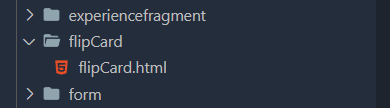
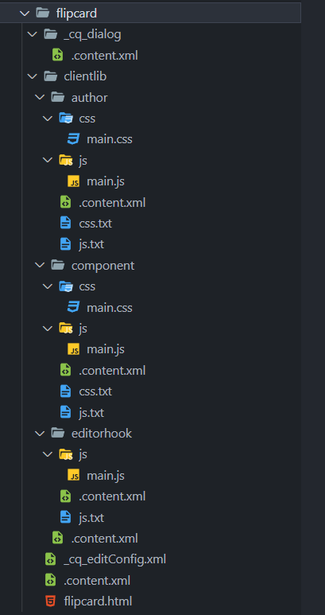

# Cómo customizar el Toolbar Action de Adobe AEM y agregar un botón:

Resultado:
[Flip Card component](../code)

## Objetivo del tutorial

Agregar un botón extra al Toolbar Action a la lista de opciones existentes al editar un custom module en el modo author. El módulo que crearemos será un "flip card" que al dar click sobre él cambie el contenido que muestre, cambiando entre la parte delantera y trasera de la tarjeta. Además, de ver como implementar la funcionalidad en el modo publicador.

<video src="../img/result.mp4" controls title="Our objective"></video>

**Nota**: En el anter

## Especificaciones de mi PC

- Windows 11
- Adobe AEM local (6.5)
- Proyecto WKND

## Pasos a seguir

### Paso 1: Crear componente

Mi componente lo crearé en la siguiente ruta: `ui.apps/src/main/content/jcr_root/apps/wknd/components` y crearé un nuevo directorio con el nombre de `flipCard` y dentro de ella crearé mi fichero `flipCard.html`. Resultando de la siguiente forma:



### Paso 2: Crear la estructura del componente

Ahora mismo, solo tenemos un archivo .html, pero crearemos la siguiente estructura de directorios y archivos para el componente:



Puede encontrar un ejemplo de un componente aquí:
[Flip Card component](../code)

**Nota**: Puede omitir algunos archivos, pues no son necesarios y puede que no se adecuen a su forma de trabajar. Pero, para lograr nuestro objetivo, debe incluir en el componente el directorio `editorhook`, pues ahí se encuentra la lógica de como agregar el botón al Toolbar Action.

### Paso 3: Customizar el `editorhook`

Para hacer tan largo el tutorial, vamos a lo importante. Es aquí donde agregaremos nuestro botón al Toolbar Action del AEM. Dentro del directorio `js` crearemos un archivo `main.js` e incluiremos el siguiente código:

```JS
(function (channel, author) {
  "use strict";

  const lastEditorToolbarAction = new author.ui.ToolbarAction({
    name: "FLIP_CARD_SLIDE",
    text: Granite.I18n.get("Flip card slide"),
    icon: "pivot",
    order: "before COPY",
    execute: function (editable, param, target) {
      const front = editable.dom.find(".acc--front");
      front.toggleClass("acc--hide");
      const back = editable.dom.find(".acc--back");
      back.toggleClass("acc--hide");
    },
    condition: function (editable) {
      return editable.type === "wknd/components/flipcard";
    },
    isNonMulti: true,
  });

  channel.on("cq-layer-activated", function (event) {
    if (event.layer === "Edit") {
      author.EditorFrame.editableToolbar.registerAction("FLIP_CARD_SLIDE", lastEditorToolbarAction);
    }
  });
})(jQuery(document), Granite.author);

```

**Propiedades**

- name: El nombre interno de la acción. **Nota**: No estoy **seguro**, pero he experimentado algunos problemas cuando repito nombres, así que recomiendo que sea un nombre único a cualquier otro componente.
- text: La etiqueta visible de la acción.
- icon: El nombre del icono que representa la acción en la barra de herramientas. [Lista de íconos disponibles](https://developer.adobe.com/experience-manager/reference-materials/6-5/coral-ui/coralui3/Coral.Icon.html)
- order: La posición de la acción en la barra de herramientas en relación con otras acciones. En este caso, se establece que aparezca antes de la acción "COPY".
- execute: La función que se ejecuta cuando se activa la acción. Funciona con jQuery el selector de los elementos.
- condition: La condición bajo la cual la acción está disponible. En este caso, la acción sólo está disponible si el tipo del componente editable es "wknd/components/flipcard".
- isNonMulti: Bandera que indica que la acción debe deshabilitarse si hay múltiples componentes seleccionados.

Finalmente, se registra un receptor de eventos para el evento "cq-layer-activated", que se activa cuando el usuario cambia entre las distintas capas de la interfaz de creación de AEM (como las capas "Editar", "Diseño" y "Vista previa").

Cuando se activa la capa "Editar", la acción se registra en la barra de herramientas. Esto garantiza que la acción sólo esté disponible en el modo "Editar" de la interfaz de autor de AEM.

## Aspectos a mejorar

- Desconozco la forma de utilizar un solo código JS entre el autor y el publicador, pues como ve en el ejemplo, he colocado 2 archivos .js separados.
- El código del author necesita de jQuery para poder acceder a los elementos HTLM, mientras que en el publicador lo estoy haciendo con JS. Desearía no utilizar jQuery para facilitar la refactorización, pero me encuentro limitado en ese aspecto.

## Créditos

No hubiese sido posible sin el código compartido por [Andrei Shilov](https://gist.github.com/AndreiShilov).

[Tutorial de AdreiShilov](https://andreishilov.dev/blog/custom-editable-toolbar-action/)
